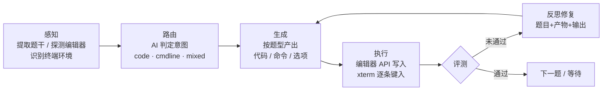

<div align="center">

# 妙答 · 编程题自动解题 Agent

**连接你已登录的浏览器，自动读题、作答、提交、评测、失败反思重做。**

不绕过任何登录校验，只操作你自己已登录的页面。

[](agent/CHANGELOG.md)
[](https://nodejs.org)
[](agent/README.md)
[](agent/package.json)
[](LICENSE)

[快速开始](#-快速开始) · [核心能力](#-核心能力) · [架构](#-架构与模块职责) · [目录结构](#-目录结构) · [贡献指南](#-贡献指南) · [已知边界](#-已知限制与边界)

</div>

> **📖 分支说明**：本分支（`feat/2-c-web-service`）= master 基线 + **网页工作台**——`npm run web`（或双击 `start-web.bat`）打开 `http://127.0.0.1:8787`，点按钮代替命令行做题，仅本机可访问。**无新增依赖**，从 master 切换后无需重新 `npm install`。原有 CLI 用法（watch / lite / course）全部保留。另有两个功能分支：`feat/3-d-capability-guard`（能力配置自动校验）、`feat/1-ad-mcp-server`（MCP 出口，让 AI 编程助手替你做题，**该分支有新增依赖**）。

---

## 这是什么

一个跑在本地的浏览器自动化 Agent。它通过 CDP（Chrome DevTools Protocol）接管你**已经登录好**的 Edge / Chrome，读取评测网页上的题目，交给大模型生成答案，然后自动写入编辑器、键入终端命令或勾选选项，点击「评测」后读取结果——未通过则带着「题目 + 上一版产物 + 评测输出」反思修复并重新提交，直到通过或达到重试上限。

主体验证场景是 **EduCoder 系平台**（含学校私有部署与 `www.educoder.net`，二者共用同一套 TPI 任务页前端）。识别逻辑全部基于 URL 路径与页面启发式，与域名无关。

> **它不是**：自动化作弊服务、题库爬虫或登录破解工具。项目不接触任何认证环节，也不存储题目内容。

### 一次完整的解题循环



---

## 核心能力

| 环节 | 行为 |
|---|---|
| **感知** | 提取题干；按结构信号识别选择 / 填空，按 AI 意图判定识别代码 / 命令行 / 混合题；探测 Monaco、Ace、CodeMirror 编辑器与 xterm 终端；实测终端内客户端可用性 |
| **作答** | 混合题先在命令行插入题面文档再落代码栏；代码题优先经编辑器 API 写入（字节级精确，不触发平台自动重排）；命令行题逐条键入终端并自适应等待提示符；选择 / 填空题支持整页批量作答 |
| **评测** | 自动点击「评测」并等待结果；`detectVerdict` 采用**否定词优先短路 + 整词匹配**，避免「未通过」误判为「通过」 |
| **反思** | 未通过时以「题目 + 上一版产物 + 评测输出」为上下文重新生成，最多 `MAX_RETRY` 轮 |
| **常驻** | `watch` 模式跟随你切换的题目页自动作答，**不替你点「下一关」**，导航权始终在你手里 |
| **重做** | `lite` 模式刷新题目页即重新作答——反思重试仍未过时，F5 即可换思路重做一遍 |
| **自动驾驶** | `course` 模式遍历「课堂实验 → 板块 → 开始学习」逐关推进（⚠️ 尚未端到端验证，见[已知边界](#-已知限制与边界)） |

### 设计上的几个关键点

1. **Prompt 单一数据源**——AI 行为只定义在 `shared/capabilities/*.json`（7 个能力配置），Agent 读取后渲染 `{{input.xxx}}` 占位符，代码内不复制 prompt，杜绝两份漂移。
2. **写入优先走编辑器 API**——Monaco / CodeMirror 先 `model.setValue` / `cm.setValue`，触发平台的自动保存；实测 `insertText` 会被 Monaco 的 `formatOnPaste / autoIndent` 逐行重排，导致评测不匹配，故键盘输入仅作回退。
3. **模板拼接而非整体覆写**——以编辑器原始模板为权威，只把 AI 生成的代码体拼回 `Begin/End` 标记之间，平台脚手架字节级不变。
4. **环境事实靠实测不靠模型记忆**——数据库客户端是否存在（`mongosh` / `mysql` / `psql` …）一律探测后写入 prompt；缺失客户端入禁令并在执行层做别名替换（`mongosh` → `mongo`）。
5. **不硬编码站点 selector**——换平台优先靠 `npm run dump` 导出真实结构后调规则，而非凭假设写死。

---

## 快速开始

### 前置条件

- **Node.js 18+**（依赖内置 `fetch`）
- **Edge 或 Chrome**（Edge 已实测可用，路径自动探测）
- 一个 OpenAI 兼容的大模型端点

### 三步跑起来

```bash
cd agent
npm install                      # 唯一依赖：playwright-core
cp .env.example .env.local       # 编辑 .env.local，填入 AI_BASE_URL / AI_API_KEY / AI_MODEL
```

**第 1 步 · 启动受控浏览器**（三选一）

| 方式 | 说明 |
|---|---|
| 双击 `agent/start-my-edge.bat` | **推荐**。重启你自己的 Edge 并带调试端口，账号 / 历史 / 插件全部保留（会有 3 秒倒计时先关闭运行中的 Edge） |
| 双击 `agent/start-browser.bat` | 全新独立 profile，首次需在该窗口重新登录各平台，之后登录态持久保存 |
| 不做任何事 | `watch` / `course` 连不上调试端口时会自动拉起独立 profile 浏览器兜底 |

**第 2 步 · 在浏览器中登录评测平台，打开一道题目页**

**第 3 步 · 启动 Agent**

```bash
npm run probe     # 首次必跑：确认题目、编辑器、终端是否被正确识别
npm run watch     # 常驻监听：切到哪道题就做哪道题
```

> **首次接入新平台**，建议先在 `.env.local` 设 `DRY_RUN=1` 干跑一轮，确认识别与生成正确后再关闭。

### 命令速查（均在 `agent/` 目录下执行）

| 命令 | 作用 |
|---|---|
| `npm run probe` | 检查配置与页面识别情况（**首次必跑**） |
| `npm run watch` | **常驻监听**：切到新题目页即自动作答（推荐） |
| `npm run lite` | **刷新触发**：刷新题目页即重新作答，同一题可反复重做 |
| `npm run once` | 只解当前这一题 |
| `npm run run` | 连续解题，通过后自动翻页 |
| `npm run course` | 课程自动驾驶：遍历板块逐关完成 |
| `npm run course-probe` | 只读诊断课程列表页识别（`course` 卡住时先跑这个） |
| `npm run my-edge` | 重启「你自己的 Edge」并带调试端口（保留登录态） |
| `npm run browser` | 命令行启动带调试端口的浏览器（独立 profile） |
| `npm run dump` | 导出页面结构快照到 `agent/dumps/`，用于精调识别规则 |
| `npm run models` | 列出可用文本模型 |
| `npm run web` | 网页工作台 `http://127.0.0.1:8787`（仅本机可访问：状态 / 探测 / 解题 / 日志流） |
| `npm test` | 运行核心纯函数单测（22 项，零新增依赖） |
| `npm run lint` | ESLint 静态检查 |
| `npm run format` | 按 Prettier 风格格式化 `src/` 与 `test/` |

Windows 用户可直接双击 `agent/` 下的 `start-my-edge.bat`、`start-browser.bat`、`start-watch.bat`、`start-lite.bat`、`start-course.bat`、`start-web.bat`（网页工作台）。

<details>
<summary><b>关键配置项</b>（完整列表见 <a href="agent/README.md">agent/README.md</a>）</summary>

| 变量 | 说明 | 默认 |
|---|---|---|
| `AI_BASE_URL` / `AI_API_KEY` / `AI_MODEL` | OpenAI 兼容端点、密钥、模型名（必填） | 无 |
| `AI_REASONING_EFFORT` | 推理分级 `low` / `medium` / `high` | `medium` |
| `AI_THINKING_CAP_MS` | 思考硬闸：持续纯思考超时即断流重试关闭思考 | `20000` |
| `DEBUG_PORT` | CDP 调试端口（默认避开 Windows 保留区间 9137–9236） | `9333` |
| `TASK_URL_PATTERN` | 题目页 URL 正则，换平台改这里 | `/tasks/[^/]+/\d+/[A-Za-z0-9]+` |
| `MAX_RETRY` | 单题最大反思重试次数 | `10` |
| `EVAL_TIMEOUT_MS` | 等待评测结果上限 | `25000` |
| `DRY_RUN` | `1` = 只感知与生成，不写入不点击 | `0` |

</details>

---

## 架构与模块职责

```
cli.mjs（入口：解析命令，分发到对应模式）
  ├─ loop.mjs（编排：单题流程 + watch / lite / course 三种常驻循环）
  │    ├─ perceive.mjs（感知：题干提取、编辑器/终端探测、评测结果读取、快照导出）
  │    ├─ ai.mjs（生成：意图路由 / 答案生成 / 反思修复 / 结果判定）
  │    └─ act.mjs（执行：写编辑器、键终端、勾选项、点评测、翻页、切工作区标签）
  ├─ browser.mjs（CDP 连接浏览器 + 挑选目标标签页）
  │    └─ launch-browser.mjs（连不上时拉起浏览器；含 my-edge 的 junction 接管）
  ├─ web-server.mjs（网页工作台：HTTP API + 单文件原生前端，仅绑 127.0.0.1）
  │    └─ browser-session.mjs（常驻进程会话管理：懒连接 + 互斥串行 + 断线重连）
  └─ config.mjs（读取 agent/.env.local 的全部配置）
```

### AI 能力配置（`shared/capabilities/`）

| 配置文件 | 用途 |
|---|---|
| `task_router_1` | 按题干判定任务类型：代码 / 命令行 / 混合 |
| `code_completion_generator_1` | 代码题生成：按题目与模板补全 `Begin/End` 之间代码 |
| `code_reflection_fixer_1` | 代码题反思：按评测输出修复代码 |
| `cmdline_runner_1` | 命令行题生成：按运维 / 数据库任务描述输出命令序列 |
| `cmdline_reflection_fixer_1` | 命令行题反思：按评测输出重新给出完整命令序列 |
| `quiz_answer_selector_1` | 单道选择 / 填空题作答 |
| `quiz_batch_answer_1` | 整页多道小题批量作答 |

> 改 AI 行为请**只改这些 JSON**，不要在 `agent/` 内复制 prompt。

---

## 目录结构

```
miaoda-code-completion-assistant/
├── agent/                          # 浏览器自动执行层（项目主体）
│   ├── src/
│   │   ├── cli.mjs                 # CLI 入口：命令解析与分发
│   │   ├── loop.mjs                # 编排：单题流程 + watch / lite / course 常驻循环
│   │   ├── perceive.mjs            # 感知：题干、编辑器、终端、评测结果、DOM 快照
│   │   ├── ai.mjs                  # 生成：意图路由 / 生成 / 反思 / 结果判定
│   │   ├── browser-session.mjs     # 常驻进程浏览器会话：懒连接 + 互斥串行 + 断线重连
│   │   ├── web-server.mjs          # 网页工作台（零新增依赖）：状态 / 探测 / 解题 / 日志流
│   │   ├── act.mjs                 # 执行：写入、键入、勾选、点评测、翻页、导航
│   │   ├── browser.mjs             # CDP 连接与标签页挑选
│   │   ├── launch-browser.mjs      # 调试端口拉起（Windows 保留端口自动顺延）
│   │   ├── config.mjs              # 配置层，读 agent/.env.local
│   │   └── logger.mjs              # 统一日志层：控制台 + 落盘到 logs/
│   ├── test/
│   │   └── ai.test.mjs             # 核心纯函数单测（node:test，零依赖）
│   ├── eslint.config.js            # ESLint flat config
│   ├── .prettierrc                 # 格式化规则
│   ├── docs/
│   │   └── TROUBLESHOOTING.md      # 14 个真实踩坑与排查方法论
│   ├── inspect-dom.mjs             # 只读 DOM 诊断脚本
│   ├── public/
│   │   └── index.html              # 网页工作台前端（单文件原生，无构建链）
│   ├── start-my-edge.bat           # 接管你自己的 Edge（双击）
│   ├── start-browser.bat           # 独立 profile 启动（双击）
│   ├── start-watch.bat             # 常驻监听（双击）
│   ├── start-lite.bat              # 刷新触发（双击）
│   ├── start-course.bat            # 课程自动驾驶（双击）
│   ├── start-web.bat               # 网页工作台（双击，仅本机访问）
│   ├── .env.example                # 配置模板（不含任何真实值）
│   ├── CHANGELOG.md                # 变更日志
│   └── README.md                   # 完整文档：配置项、工作流、设计要点、已知限制
├── shared/
│   └── capabilities/               # AI prompt 单一数据源（7 个能力配置）
├── AGENTS.md                       # 面向 AI 开发代理的项目说明
├── LICENSE                         # MIT
└── README.md                       # 你正读的这份
```

已被 `.gitignore` 排除、**严禁提交**的路径：`agent/.env.local`（密钥）、`agent/.browser-profile*/`（登录 Cookie）、`agent/dumps/`（含个人信息的页面快照）、`agent/logs/`（运行日志）。

---

## 贡献指南

欢迎 Issue 与 PR。这个项目的主要价值在于**对真实平台的适配经验**，因此最稀缺的贡献不是代码风格，而是踩坑记录。

**提交 Issue 时，请优先附上：**

```bash
cd agent && npm run dump      # 导出页面结构快照（提交前请自行脱敏）
```

把 `agent/dumps/` 下的快照与 `probe` 输出一并贴出，比文字描述「识别不出来」有效得多。

**开发约定：**

| 约定 | 说明 |
|---|---|
| Prompt 只在 JSON 里 | AI 行为一律改 `shared/capabilities/*.json`，禁止在 `agent/` 内复制 prompt |
| 不硬编码站点 selector | 新增平台适配前先 `npm run dump` 拿真实结构，识别一律走通用启发式 |
| 环境事实靠实测 | 终端客户端可用性、终端形态等必须用 `probeTerminalClients` 探测，不得依赖模型记忆 |
| 如实标注验证边界 | 未经验证的能力不得在文档中声称可用；新增功能请在 README 注明验证程度 |
| 密钥零落盘 | 端点 / 密钥 / 模型名只允许出现在 `agent/.env.local` |

**提交前自检**（均在 `agent/` 下执行）：

```bash
npm test          # 22 项纯函数单测必须全绿
npm run lint      # ESLint 零问题
```

改动 `ai.mjs` 中的纯函数（`detectVerdict` / `sanitizeShellSubmission` / `spliceIntoTemplate` / `renderTemplate` / `parseAnswers`）时，请同步补单测——1.1.0 的首批测试当场就暴露了一个真实判定缺陷。

**Commit 规范**：沿用现有风格 `feat|fix|chore(release): <版本> —— <一句话变更>`，提交前先跑一遍 `npm run probe` 确认未破坏识别逻辑。

---

## 已知限制与边界

如实标注，不含美化：

- **浏览器接管有硬约束**：调试端口必须在浏览器**启动时**带上，无法事后接入正在运行的普通 Edge；Edge 136+ 禁止在默认用户目录开调试端口，`my-edge` 用目录联接（junction）绕过。接管后从任务栏正常打开的 Edge 不带端口，需重跑 `my-edge`。
- **`course` 模式尚未端到端验证**。列表卡片 / 板块菜单 / 退出图标均为通用启发式识别，首次运行前建议先在列表页 `npm run dump` 确认结构。
- **题型覆盖不完整**：选择与填空题目前只做单轮作答，未实现失败反思；多空填空依赖模型遵循格式约定。
- **新平台大概率需要调规则**：页面识别基于通用启发式，已在真实 EduCoder 站点（校内私有部署）完成代码题端到端联调（自动提交成功），课程列表页采集经真实页面回归验证（9 卡片 / 17 板块），但换平台仍需 `dump` 后针对性适配。
- **评测结果依赖 DOM 文本**：若平台把结果渲染在 canvas 或图片中，无法读取。
- **混合题依赖终端可用**：评测环境共享终端数据库，题面要求「先在命令行插入文档」时未插入则代码栏查询结果为空。
- **编辑器写入**在非 Monaco / Ace / CodeMirror / textarea 的自研编辑器上可能失效，此时 `probe` 会显示「编辑器：未识别」。

---

## 安全与合规

- 一切个人配置（端点、密钥、模型名）只存在于 `agent/.env.local`，源码与 `.env.example` 中不落真实值。
- 本工具**不绕过任何登录校验**，仅操作你已登录的页面。但自动提交与自动翻页作用于你的**真实账号**，是否违反目标平台的使用条款，请自行评估并承担相应责任。
- 本项目仅供学习与技术交流使用。

---

## 许可证

[MIT](LICENSE) © 2026 吴国伟

---

## 相关文档

| 文档 | 内容 |
|---|---|
| [`同学使用指南.md`](同学使用指南.md) | **傻瓜式教程**：从零装环境到自动做题，给第一次用的同学 |
| [`agent/README.md`](agent/README.md) | 完整文档：全部配置项、三种工作模式详解、设计要点、平台兼容性 |
| [`agent/docs/TROUBLESHOOTING.md`](agent/docs/TROUBLESHOOTING.md) | 14 个真实踩坑（环境级 + 代码级）与排查方法论 |
| [`agent/CHANGELOG.md`](agent/CHANGELOG.md) | 变更日志 |
| [`shared/capabilities/README.md`](shared/capabilities/README.md) | AI 能力配置说明 |
| [`AGENTS.md`](AGENTS.md) | 面向 AI 开发代理的项目说明与硬约束 |

早期版本包含一个手动粘贴式的 React 工作台前端，现已移除（项目聚焦自动执行层），历史版本见 git 提交 `3cc19d3`。本分支另提供一个**仅本机访问**的网页工作台（`npm run web`，单文件原生前端、无构建链）——定位是最小可用形态，与当年被移除的 React 工作台无关。

---

<div align="center">

如果这个项目对你有用，欢迎点个 Star ⭐

</div>
